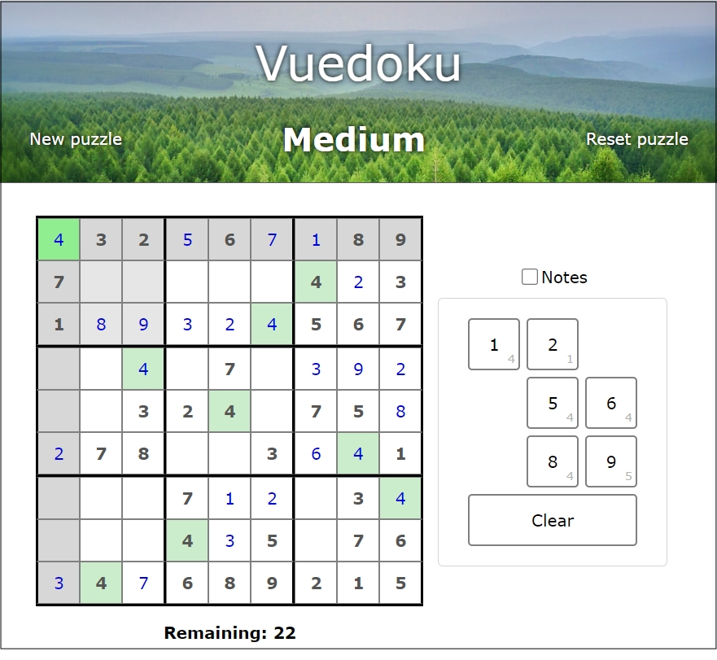

# Vuedoku

A simple Sudoku game written using [Vue.js](https://vuejs.org/).

It utilises the [Dosuku](https://sudoku-api.vercel.app/) API for boards and [Unsplash](https://unsplash.com/) for the pleasant images.

You can play it here:

https://kimmknight.github.io/Vuedoku/

